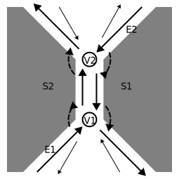
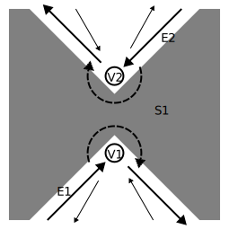
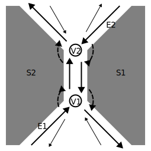
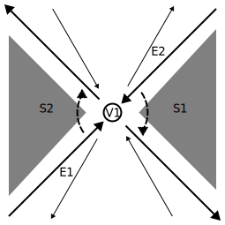

# DCEL - Doubly connected edge list

This library manage connected simple planar graph.

To make eular characteristics is eqauls 2, You have to start hava three edges
triangle graph.

triangle graph property.  

- 1 It has 3 edges.
- 2 It has 2 faces.
- 3 It has 3 vertices

eular euqage x = v - e + f = 3

## new

create doubly edged linked list

    my $dcel = Decl->new;
    my $triangle_edge = $decel->create_triangle;
    my $twin = $triangle_edge->twin;

## create\_triangle 

create triangle

    my $triagle = $dcel->create_triangle;

## face\_count

get count of faces which belong to dcel object

    my $face_count = $dcel->face_count;

## vertex\_count

get count of vertices which belog to dcel object

    my $vert_count = $dcel->vertex_count;

## eular\_characteristic

get eular characteristic.

Eular characteristic is calculated by followings.
vertices count: c(v)
edges count: c(e)
faces count: c(f)

Eular characteristics: c(v) - c(e) + c(f)

    my $ec1 = $decl->vertex_count - $decl->edge_count + $dcel->face_count;
    my $res = $ec1 == $decl->eular_characteristic;
    # we will always get true from $res
     

## split\_face

split a face into two faces.

    my $succeeded = $dcel->split_face(e1 => $edge1, $e2 => $edge2);
    if ($succeeded) {
       # you get new face and edge from $edge1
       my $new_face = $edge1->face;
       my $new_ege = $edge1->next;
    }

## join\_faces

join two faces into a face

    # you will not get the face of edge if you do join_faces operation.
    my $old_face = $edge->face;
    my $the_face = $edge->twin->face;

    my $succeeded = $dcel->join_facefaces($edge);
    if ($succeeded) {
       my $is_same_face = $the_face == $edge->face;
       # $is_same_face is 1
    }

You will understand this operation clearly, if you see operation 
diagrams(split-face.svg, join-face.svg).

    

      
      
    

## split\_vertex

split a vertex into two vertices
prerequisite

- 1 edge1 and edge2 share same origin.
- 2 edge1 and edge2 is not same

    my $next_edge = $edge->next;

    my $succeeded = $dcel->split_vertex(e1 => $edge1, e2 => $edege2);
    
    if ($succeeded) {
        my $new_edge = $edge1->next;
     
        my $same_edge = $next_edge->prev == $new_edge;
        # $same_edge is 1
    }

## join\_vertices

join two vertices into a vertex

    my $removed_vertex = $edge->twin->origin;
    my $prev_edge = $edge->prev;
    my $succeeded = $dcel->join_vertices($edge);

    if ($succeeded) {
        my $new_edge = $prev_edge->next;
        my $is_not_same = $new_edge != $edge;  
        # $is_not_same is 1 
    }

You will understand this operation clearly, if you see operation 
diagrams(split-vertex.svg, join-vertices.svg).

    

      
      
    

